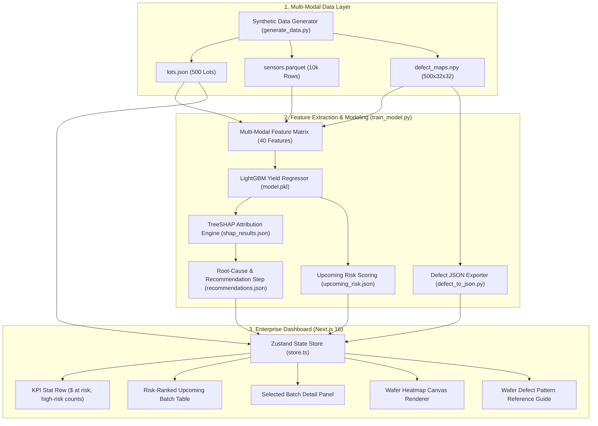

# Architecture

## System Architecture

**WaferGuard** consists of three core layers: Data Synthesis & Multi-Modal Feature Extraction, Machine Learning & SHAP Attribution, and the Next.js Frontend Dashboard.

---

## Components

| Component | Technology | Responsibility |
|---|---|---|
| **Data Generation & Physics Simulator** | Python, NumPy, Pandas | Simulates nominal semiconductor fab runs and 4 fault modes: chamber pressure drift, particle bursts, RF power oscillation, and gas blockage. |
| **Feature Extraction Engine** | NumPy, SciPy, PyArrow | Computes 30 sensor statistical moments & trend slopes, plus 5 spatial defect metrics (density, edge energy ratio, cluster score). |
| **Yield Regressor** | LightGBM (`LGBMRegressor`) | Predicts expected wafer lot yield with high accuracy ($R^2 = 0.8811$, $\text{MAE} = 3.53\%$). |
| **Root-Cause Attribution Engine** | TreeSHAP | Ranks feature contributions per lot with exact game-theoretic attributions (99.2% fault attribution accuracy). |
| **Recommendation Engine** | Python, JSON | Maps identified sensor and recipe root causes to actionable corrective SOP instructions for fab operators. |
| **Frontend Web Application** | Next.js 16, React 19, TypeScript | Provides real-time dashboard UI with risk filtering, parameter inspector, and batch triage. |
| **Wafer Heatmap Renderer** | HTML5 Canvas API | Renders high-resolution circular silicon wafer defect heatmaps with orientation notch and multi-tier color scaling. |
| **State Management** | Zustand | Manages client-side lot filtering, batch selection, and reactive data updates. |

---

## Data Flow

1. **Generation / Ingestion**:
   - `generate_data.py` generates 500 historical wafer lots with process recipes, 20-step sensor traces, and 32×32 defect maps.
2. **Feature Engineering & Modeling**:
   - `train_model.py` fuses process params, sensor summary stats, and defect map spatial metrics into a 40-column matrix.
   - LightGBM regressor trains on 80/20 train/test split.
   - TreeSHAP computes per-lot feature attributions.
3. **Pre-Run Upcoming Scoring**:
   - 20 upcoming batches are scored using strictly planned recipe parameters (pre-run prediction).
   - Expected yields and SHAP drivers determine risk tier (`high`, `medium`, `low`).
4. **Defect Export**:
   - `defect_to_json.py` formats 32×32 defect maps into compact JSON payloads for client-side rendering.
5. **Dashboard Consumption**:
   - Next.js client loads pre-computed JSON artifacts, populates Zustand store, and presents responsive views on desktop and mobile.

---

## Security & Reliability Considerations

- **Zero Data Leakage**: Upcoming batch predictions strictly isolate planned parameters from sensor/defect post-run data.
- **Client-Side Rendering Performance**: Defect maps are rounded and serialized with compact separators (~550 KB total) for sub-second page loads.
- **Type Safety**: Full TypeScript interfaces across all data models (`UpcomingLot`, `Recommendation`, `DefectMap`, `HistoricalLot`).
