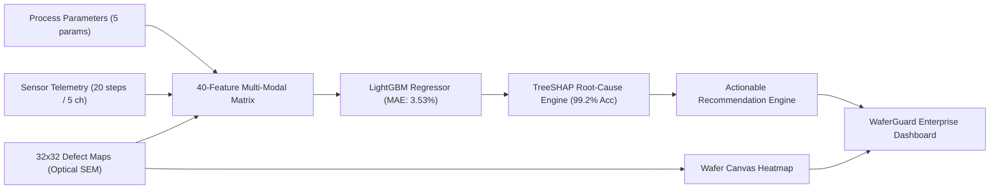

# Solution Overview

## What We Built

**WaferGuard** is an end-to-end semiconductor fab yield prediction, defect pattern analysis, and root-cause prevention platform. It unifies process recipe parameters, high-frequency equipment sensor time-series, and 32×32 wafer defect spatial maps into a single multi-modal ML pipeline and human-friendly enterprise dashboard.

Before a new batch runs, WaferGuard predicts its expected yield, flags high-risk recipes, isolates root causes with mathematical SHAP attribution, generates predicted wafer defect heatmaps, and provides step-by-step corrective engineering actions.

---

## How It Works

1. **Multi-Modal Data Ingestion**:
   - Ingests nominal recipe parameters (Temperature, Chamber Pressure, RF Power, Gas Flow, Etch Time).
   - Ingests 20-step high-frequency sensor traces across all critical chamber channels.
   - Ingests 32×32 spatial wafer defect maps from optical inspection.

2. **Feature Extraction & Multi-Modal Fusion**:
   - Computes statistical moments (mean, standard deviation, min/max, range) and linear trend slopes (OLS) for all sensor channels.
   - Extracts spatial defect metrics: `defect_density`, `defect_edge_ratio` (perimeter vs center energy), `defect_cluster_score`, `defect_mean`, and `defect_max`.
   - Assembles a 40-feature multi-modal representation.

3. **LightGBM Yield Regressor & TreeSHAP Attribution**:
   - High-performance gradient boosted decision trees predict wafer yield percentage ($R^2 = 0.8811$, $\text{MAE} = 3.53\%$).
   - Computes TreeSHAP feature attributions for every batch, ranking root causes by probability and impact.
   - Achieves **99.2% root-cause attribution accuracy** across known fault scenarios (chamber pressure drift, particle spikes, RF power instability, gas flow blockages).

4. **Pre-Run Predictive Batch Flagging**:
   - Scores planned upcoming batches using *only* pre-run recipe parameters (zero data leakage).
   - Categorizes batches into Risk Tiers: **High Risk** (&lt;80% yield), **Moderate Warning** (80%–90%), and **Normal** (&gt;90%).

5. **Human-Friendly Quality Control Dashboard**:
   - Interactive Next.js interface with real-time risk filtering, plain-English root-cause explanations, live circular silicon wafer `<canvas>` heatmaps, and actionable corrective recommendations.

---

## Architecture Diagram

> For full technical details and component specifications, see [`architecture.md`](architecture.md).

---

## Key Design Decisions

| Decision | Rationale |
|---|---|
| **TreeSHAP for Root-Cause Ranking** | Provides exact, game-theoretic additive feature attributions without sampling variance, giving process engineers provable root-cause ranking. |
| **LightGBM Multi-Modal Feature Extraction** | Gradient-boosted trees natively handle heterogeneous multi-modal tabular data (continuous sensor physics + spatial defect metrics) with high inference speed. |
| **Pre-Run vs Post-Run Separation** | Ensures upcoming lot predictions use strictly planned recipe parameters, preventing target leakage and enabling true pre-emptive intervention. |
| **HTML5 Canvas Silicon Heatmap** | High-DPI hardware-accelerated circular wafer rendering with orientation notch and multi-tier color scaling, providing instant visual feedback. |
| **Human-Friendly Enterprise UI** | Clean, light-themed typography and plain English labels ensure operations and maintenance teams can triage batches in seconds without deciphering ML equations. |
